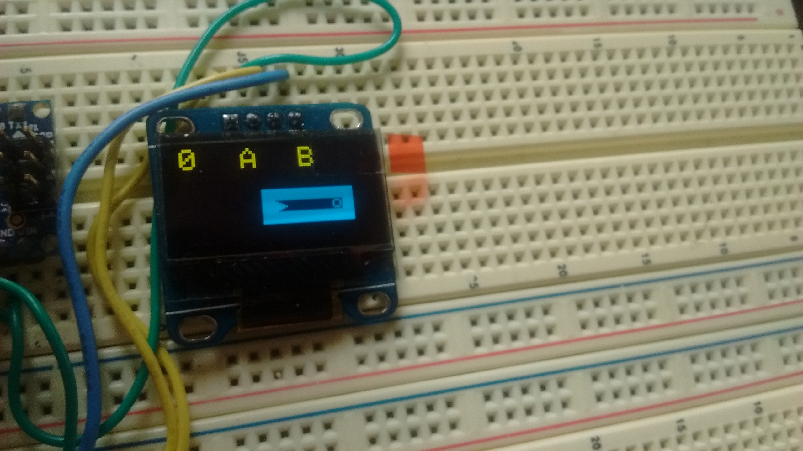

# Arduino Game

This is a game I made for arduino, using an Arduino Nano V3.0, a 128x64 monochrome OLED screen, and a NES controller.




## Setup

This project used an Arduino Nano V3.0, though you should be able to use just about any Arduino that has enough memory.

The display I used was a DIYMall 128x64 Monochrome OLED display. It was connected via I2C.

To control the game I used an NES controller.

### Pins

```
NES Controller
            ___
      GND - |O \
NES_CLOCK - |OO| - 5V
NES_LATCH - |OO| - Unused
 NES_DATA - |OO| - Unused
            ----
```

| Name      | Pin |
|-----------|-----|
| NES_LATCH |  D2 |
| NES_CLOCK |  D3 |
| NES_DATA  |  D4 |
| OLED SDA  |  A5 |
| OLED SCL  |  A4 |
